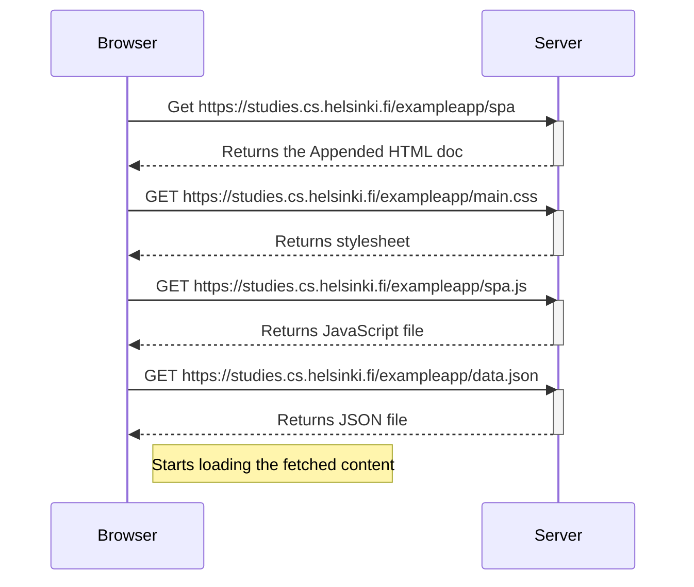

Diagram for the single page app.

```mermaid
sequenceDiagram
    
    Browser->>Server: Get https://studies.cs.helsinki.fi/exampleapp/spa
    activate Server
    Server-->>Browser: Returns the Appended HTML doc
    deactivate Server
    Browser->>Server: GET https://studies.cs.helsinki.fi/exampleapp/main.css
    activate Server
    Server-->>Browser: Returns stylesheet
    deactivate Server
    Browser->>Server: GET https://studies.cs.helsinki.fi/exampleapp/spa.js
    activate Server
    Server-->>Browser: Returns JavaScript file
    deactivate Server
    Browser->>Server: GET https://studies.cs.helsinki.fi/exampleapp/data.json
    activate Server
    Server-->>Browser: Returns JSON file
    deactivate Server
    Note Right of Browser: Starts loading the fetched content
```
